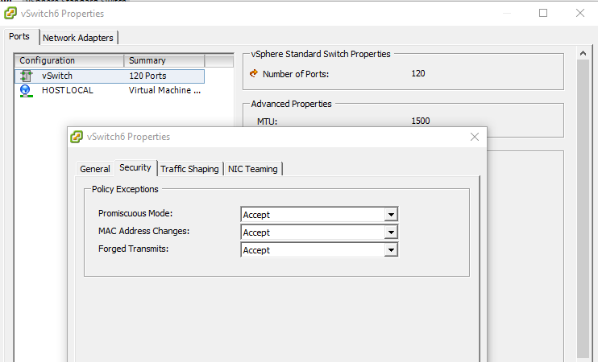

# Kubernetes Apache VCL

This project allows for deploying [Apache VCL](https://vcl.apache.org/) to a [Kubernetes](https://kubernetes.io) cluster

# Pre-Requisites

You will need the following setup before you can use VCL in Kubernetes

1. Working Kubernetes cluster
```
$ kubectl get nodes
NAME      STATUS    ROLES     AGE       VERSION
master    Ready     master    10d       v1.8.4+coreos.0
w1        Ready     node      10d       v1.8.4+coreos.0
w2        Ready     node      10d       v1.8.4+coreos.0
```
2. [CNI Genie Network Plugin](https://github.com/Huawei-PaaS/CNI-Genie)
```
$ kubectl get pod -n kube-system
NAME                                    READY     STATUS    RESTARTS   AGE
calico-node-9qfl6                       1/1       Running   0          10d
calico-node-dqjb8                       1/1       Running   0          10d
calico-node-lvgk4                       1/1       Running   0          10d
genie-5bczq                             1/1       Running   0          10d <--- Genie Pod
genie-hhbql                             1/1       Running   0          10d <--- Genie Pod
kube-apiserver-master                   1/1       Running   0          10d
kube-controller-manager-master          1/1       Running   0          10d
kube-dns-cf9d8c47-gbn29                 3/3       Running   0          10d
kube-dns-cf9d8c47-r94ct                 3/3       Running   0          10d
kube-proxy-master                       1/1       Running   0          10d
kube-proxy-w1                           1/1       Running   0          10d
kube-proxy-w2                           1/1       Running   0          10d
kube-scheduler-master                   1/1       Running   0          10d
kubedns-autoscaler-86c47697df-wqm5v     1/1       Running   0          10d
kubernetes-dashboard-85d88b455f-q92t4   1/1       Running   0          10d
nginx-proxy-w1                          1/1       Running   0          10d
nginx-proxy-w2                          1/1       Running   0          10d
```
3. [macvlan](https://github.com/containernetworking/plugins/tree/master/plugins/main/macvlan) plugin configured on the worker nodes where the VCL management daemon pod will be running. This is needed for providing access to the private VM Network on the management nodes. A sample macvlan configuration file (/etc/cni/net.d/20-macvlan.conf) is shown below. This file should be available on each minion where the management node pod will be running. Replace the "master" with the network interface that is connected to the private VM Network.
```
{
	"name": "vmprivate",
	"type": "macvlan",
	"master": "ens192",
	"ipam": {
		"type": "dhcp"
	}
}
```
4. The network interface where the management daemon pod will try to get DHCP address needs to have promiscuous mode enabled. This setting should be enabled on each minion where the management node pod will be running.
```
sudo ip link set ens192 promisc on
```

5. The VMWare switch where this network interface will be connected also needs to have promiscuous mode enabled. 


6. CNI DHCP Server Daemon configured. This can be setup on systemd enabled system using below steps:

  a. Create new file /etc/systemd/system/cni-dhcp.service
  ```
  [Unit]
  Description=CNI DHCP Server
  After=network.target

  [Service]
  Type=simple
  ExecStartPre=/bin/rm -f /run/cni/dhcp.sock
  ExecStart=/opt/cni/bin/dhcp daemon
  ExecStopPost=/bin/rm -f /run/cni/dhcp.sock
  Restart=always
  RestartSec=10s

  [Install]
  WantedBy=multi-user.target
  ```

  b. Enable the cni-dhcp Service
  ```
  sudo systemctl daemon-reload
  sudo systemctl enable cni-dhcp.service
  ```

  c. Start the cni-dhcp Service
  ```
  sudo systemctl start cni-dhcp.service
  ```

# Deploying VCL to kubernetes
This section describes the deployment of the VCL application

## Configuration

## Deployment
